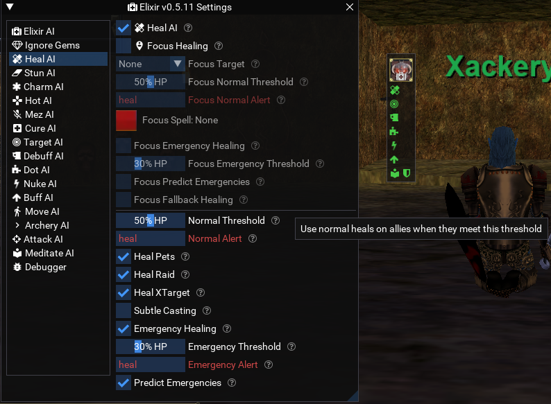
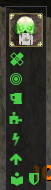
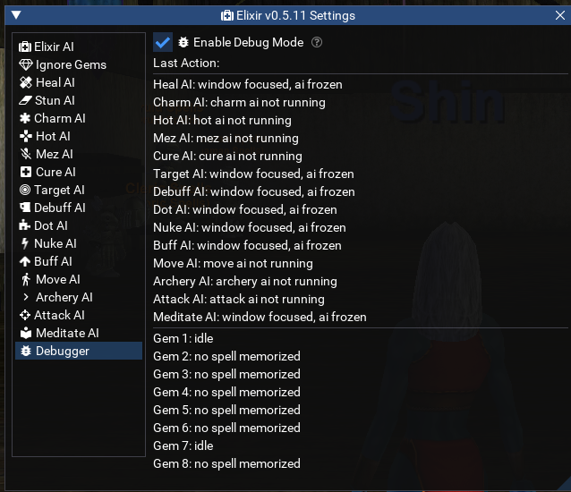

# elixir
Elixir is a set of simple MQ scripts to assist you on playing boxed characters.

Elixir analyzes spells as they're memorized and works with custom ones.

## Setup

[Download a zip copy](https://github.com/xackery/elixir/archive/refs/heads/main.zip) or clone the repo.
Extract the zip contents into your MQ's lua folder, it will make a folder like lua\elixir-main\[ai/logic/ui/etc folders]
You can go in game and type `/lua run elixir-main`, or rename the folder to whatever you like.

That's it. elixir is two parts:

HUD:

Clicking each icon quick links you to each AI. The icons poof if the AI is not on. Clicking the class icon on top is the main sections

Settings:

Each section in the settings window can be tweaked real time. Debug mode can be handy to sort out why certain behaviors are happening.

Note that your spell gems prioritize casting order, so more important situational spells you should put on top, and non-priority to bottom.
